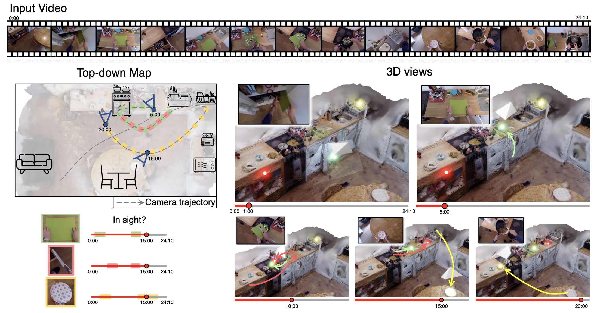

# Spatial Cognition from Egocentric Video: Out of Sight, Not Out of Mind

This is the official resource for the 3DV 2025 paper "Spatial Cognition from Egocentric Video: Out of Sight, Not Out of Mind" including the evaluation video IDs and the code for evaluation.

[**Project Webpage**](https://dimadamen.github.io/OSNOM/)



## Install the environment
Please install the dependencies using 

`conda env create --name OSNOM --file environment.yml`

## Data Preparation

### How to Download the Videos

The videos used for OSNOM evaluation come from the EPIC-KITCHENS-100 Dataset. These include videos from EK-55, indicated with `PXX_YYY` (where `XX` is the participant ID and `YYY` is the video number), and videos from EK-100, indicated with `PXX_YY` (where `XX` is the participant ID and `YY` is the video number).

- **Download EK-55 Videos**: [EK-55 Dataset](http://dx.doi.org/10.5523/bris.2g1n6qdydwa9u22shpxqzp0t8m)
- **Download EK-100 Videos**: [EK-100 Dataset](http://dx.doi.org/10.5523/bris.3h91syskeag572hl6tvuovwv4d)

For testing, we used 100 videos, and for validation, we used 10 videos. You can find the list of these videos in `data/video_splits.txt`.

### 3D mesh reconstruction

For 3D reconstruction, we prepare data in a COLMAP-friendly format.

#### Camera poses

Download the sparse registered frames in COLMAP format computed by [Epic Fields](https://epic-kitchens.github.io/epic-fields/) from [here](https://www.dropbox.com/scl/fo/0wtphqqyp4fu6bd7dhbfs/h?rlkey=ju21graeixi6vpecrf7rqurpt&e=1&dl=0) into `data/colmap_models/sparse/` and structure files as:
```
data/colmap_models/sparse/
    ├── P01_01/
    │   ├── database.db
    │   └── sparse/0/
    │       ├── cameras.bin
    │       ├── images.bin
    │       └── points3D.bin
    ├── P01_02/
    │   ├── database.db
    │   └── sparse/0/
    │       ├── cameras.bin
    │       ├── images.bin
    │       └── points3D.bin
    └── ...
```
You may do so using:
```bash
# $VIDEO_ID.zip -> unzips to folder with db and sparse/0/*
mkdir -p data/colmap_models/sparse/
unzip ${VIDEO_ID}.zip -d data/colmap_models/sparse/$VIDEO_ID/
```

Extract image frames to `data/aggregated/images/$VIDEO_ID/frame_XXXXXXX.jpg` from the downloaded videos to be in sync with the frame names/numbers in `images.bin` above, or directly download the image frames from the EPIC-KITCHENS dataset in this format using:
```bash 
#### Extracted Images
bash code/mesh_generation_code/download_images.sh $VIDEO_ID
```

#### Running COLMAP to generate 3D meshes

First, install [COLMAP](https://colmap.github.io/) with CUDA support. Then, you may reconstruct the mesh for each video using the following script:

```bash
bash code/mesh_generation_code/reconstruct_mesh.sh $VIDEO_ID
# Saves reconstructed meshes to data/colmap_models/dense3D/$VIDEO_ID/fused-minpix15-meshed-poisson-d10-t5.ply
```

### Scaling Scores

The mesh of each video has different scales. We rescale each kitchen using cupboards as the standard unit, which is 60 cm (or 24 inches). The scores for rescaling each kitchen are provided in the file `data/scaling_scores_dict.txt`.

### 2D Object Masks

We use active object masks from [VISOR](https://epic-kitchens.github.io/VISOR/) in our method and baselines. The VISOR mask annotations can be downloaded from the following link: [VISOR Annotations](https://doi.org/10.5523/bris.2v6cgv1x04ol22qp9rm9x2j6a7) by accessing the [`Interpolations-DenseAnnotations/train/`](https://data.bris.ac.uk/data/dataset/a303c84f43214cdb0f31d53f51aa4786) directory. Note they also provide a file that maps frame numbers between VISOR and publicly released rgb_frames in EPIC-KITCHENS-55 and EPIC-KITCHENS-100.
You can find this at: [frame_mapping.json](https://data.bris.ac.uk/datasets/2v6cgv1x04ol22qp9rm9x2j6a7/frame_mapping.json).

### Camera Poses

The directory structure for the dataset used in the provided command should look as follows:
We use camera poses from the [EPIC-Fields dataset](https://epic-kitchens.github.io/epic-fields/). Dense camera poses annotations can be downloaded from the following link: [camera poses](https://www.dropbox.com/scl/fo/onqyany4ze39pknck49ir/AKTS2LUt3WxFd02z7GdLYqM?rlkey=fc8gb6dz1pi6r89b30ma43x3m&e=1&dl=0).

```
### Final Data Structure

./data/aggregated/{VIDEO_ID}/
│
├── poses.json                # Contains the camera poses
├── fused-minpix15-meshed-delaunay-qreg5.ply  # 3D mesh for the video
└── mask_annotations.json      # Contains the VISOR mask annotations 
```

Where `{VIDEO_ID}` is the name of the specific video being processed, `poses.json` are the dense camera poses from EPIC-Fields, `fused-minpix15-meshed-delaunay-qreg5.ply` is the extracted mesh, `mask_annotations.json` are the VISOR mask annotations from VISOR. 

In addition, the path for frames is located at:

```
./EPIC-KITCHENS/{participant}/rgb_frames/{VIDEO_ID}/
│
├── frame_001.jpg             # RGB frames for each video frame
├── frame_002.jpg
├── frame_003.jpg
└── ...                       # Other RGB frames for the video
```

Where `{participant}` and `{VIDEO_ID}` are specific to the video being processed.


### Feature Extraction

We provide the code for extracting 2D and 3D features in `code/tracking_code/extract_feat`. You can run the scripts `save_feat_batch_2D.py` and `save_feat_batch_3D.py` for extracting them, using the following commands:

```python
python code/tracking_code/scripts/extract_feat_2D.py
```
```python
python code/tracking_code/scripts/extract_feat_3D.py
```


The output is a dictionary with the following format:

```python
{
    "frame_name_1": (
        features,  # Numpy array of feature vectors for objects in the frame
        object_ids            # List of object identifiers for the tracked objects
    ),
    "frame_name_2": (
        features,
        object_ids
    ),
    ...
}
```
The path where the 2D and 3D features are saved is as follows:

```
./saved_feat_2D/{video}/2D_feat_{video}.pkl
./saved_feat_3D/{video}/3D_feat_{video}.pkl
```

## Code

### Tracking Code

We provide the code for tracking objects in `code/tracking_code/`. You can run the script `code/tracking_code/scripts/run_tracker.sh` for tracking. The output is a dictionary with the following format:

```python
results = {
    'frame_0000000266': {
        'tracked_ids': [17037, 17038, 17039, 17040],  # IDs of tracked objects
        'tracked_gt': ['hob', 'pan', 'food', 'spatula'],  # Ground truth labels
        'loca': [
            # Locations of each tracked object in 3D space
            array([[ 1.96576973], [-1.94863633], [ 4.10698705]]),  # Object 17037
            array([[ 2.76235275], [-2.03886724], [ 3.66689389]]),  # Object 17038
            array([[ 2.71587213], [-2.72918236], [ 3.84018456]]),  # Object 17039
            array([[ 3.04709036], [-2.687437  ], [ 3.78788571]])   # Object 17040
        ]
    },
    ...
}
```

Here is a description of the output:

`tracked_ids`: A list of IDs corresponding to the tracked objects in each frame.

`tracked_gt`: A list of ground truth labels for the tracked objects.

`loca`: A list of 3D location arrays, where each array specifies the position [x, y, z] of a tracked object.

### Evaluation Code

We provide the code to compute PCL (Percentage of Correctly Located) results in <code>code/evaluation_code/evaluate.py</code>. The code takes the following inputs:

```python
Args:
    results (dict): A dictionary containing tracking results with frame names as keys.
```

The output is a dictionary with the following format:

`results_grid[n][r] = percentage`

Where `n` represents the distance in frames from the evaluation frame, and `r` is the radius. For each evaluation frame at distance `n` and for each radius `r`, we save the percentage of correctly located objects.

For running the evaluation on all videos, just run the following script:

```python
python code/evaluation_code/scripts/run_eval.py
```

## BibTeX

If you use our code, please cite:

<code>@inproceedings{Plizzari2025OSNOM,
    title={Spatial Cognition from Egocentric Video: Out of Sight, Not Out of Mind},
    author={Plizzari, Chiara and Goel, Shubham and Perrett, Toby and Chalk, Jacob and Kanazawa, Angjoo and Damen, Dima},
    booktitle={2025 International Conference on 3D Vision (3DV)},
    year={2025}
}</code>


All files in this repository are copyright by us and published under the Creative Commons Attribution-NonCommerial 4.0 International License, found <a href="http://en.wikipedia.org/wiki/Main_Page">here</a>. This means that you must give appropriate credit, provide a link to the license, and indicate if changes were made. You may do so in any reasonable manner, but not in any way that suggests the licensor endorses you or your use. You may not use the material for commercial purposes.
## License


Research at Bristol is supported by EPSRC Fellowship UMPIRE (EP/T004991/1) and EPSRC Program Grant Visual AI (EP/T028572/1). We particularly thank Jitendra Malik for early discussions and insights on this work. We also thank members of the BAIR community for helpful discussions. This project acknowledges the use of University of Bristol’s Blue Crystal 4 (BC4) HPC facilities. 
## Acknowledgements

